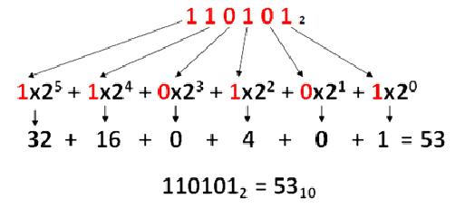

# Sistemas Binarios

## Definición de sistema digital
Un **sistema digital** es un conjunto de elementos digitales o electrónicos que trabajan en conjunto para cumplir una función determinada, a partir de señales de entrada que son procesadas para producir señales de salida.

* Trabaja con valores discretos (0 y 1).
* Se utiliza en computadoras, calculadoras, relojes digitales, controladores, entre otros.
* Permite mayor precisión y facilidad de almacenamiento que un sistema analógico.

> Conjunto de elementos digitales o electrónicos para cumplir una función con entradas y salidas.

## Sistema digital vs Sistema analógico

### Sistema digital
* Utiliza únicamente dos estados: **1** y **0**.
* Tiene un significado matemático (1 y 0), pero a nivel físico corresponde a un nivel de voltaje: aproximadamente **5V** (o 3.3V dependiendo del sistema) para representar el 1, y **0V** para representar el 0. Es decir, "prendido" o "apagado".
* Tiene una frecuencia de trabajo asociada a pulsos discretos (transiciones entre 0 y 1), no una señal continua.
* Presenta **inmunidad a interferencias**, ya que al trabajar solo con dos niveles bien diferenciados de voltaje, es más difícil que el ruido eléctrico altere la interpretación de la señal.
* Es más fácil de almacenar, transmitir y reproducir sin pérdida de calidad.

### Sistema analógico
* Para cada valor de entrada **x** existe un valor de salida **y**, es decir, la señal varía de forma **continua** en el tiempo.
* Ejemplo: una señal analógica puede tener una frecuencia de, por ejemplo, **110 Hz**, variando suavemente entre distintos valores de voltaje.
* Es más susceptible a interferencias o ruido, ya que cualquier variación de voltaje puede alterar la información transmitida (por ejemplo, la estática en una señal de radio AM/FM).
* Ejemplos de señales analógicas: sonido, temperatura ambiente, señales de radio y televisión antiguas (previas a la digitalización).

### Tabla comparativa

| Característica              | Sistema Digital                  | Sistema Analógico            |
|:----------------------------|:----------------------------------|:------------------------------|
| Valores que maneja          | Discretos (0 y 1)                 | Continuos                     |
| Representación física       | Niveles de voltaje (0V / 5V)      | Variación continua de voltaje |
| Inmunidad al ruido          | Alta                              | Baja                          |
| Precisión                   | Alta, exacta                      | Depende de la calidad de la señal |
| Ejemplo                     | Computadoras, relojes digitales   | Termómetro de mercurio, radio AM |

## Conceptos de almacenamiento

* **Bit**: es la unidad más pequeña de información o memoria; puede tomar solamente dos valores, 0 o 1.
* **Byte**: conjunto de **8 bits**. Es la unidad básica utilizada para representar caracteres (letras, números, símbolos) en un sistema digital.
* **Ancho de banda**: se refiere a la cantidad de datos que pueden transmitirse en un periodo de tiempo determinado; se mide en unidades como **Megabit (Mb)**, mientras que el tamaño de almacenamiento se mide en **Megabyte (MB)**, **Gigabyte (GB)** o **Terabyte (TB)**.

### Ejemplo de múltiplos del byte

| Unidad     | Equivalencia aproximada |
|:-----------|:--------------------------|
| 1 byte     | 8 bits                    |
| 1 KB       | 1024 bytes                |
| 1 MB       | 1024 KB                   |
| 1 GB       | 1024 MB                   |
| 1 TB       | 1024 GB                   |

> Nota: Es importante no confundir **Megabit (Mb)**, usado normalmente para medir velocidades de conexión a internet, con **Megabyte (MB)**, usado para medir el tamaño de archivos. 1 Byte = 8 bits, por lo que una conexión de 100 Mb/s equivale aproximadamente a 12.5 MB/s.

## Sistemas numéricos

Los sistemas numéricos más utilizados en electrónica digital y computación son:

* **Binario** (base 2): utiliza los dígitos 0 y 1.
* **Octal** (base 8): utiliza los dígitos del 0 al 7.
* **Decimal** (base 10): utiliza los dígitos del 0 al 9, es el sistema numérico convencional utilizado por las personas.
* **Hexadecimal** (base 16): utiliza los dígitos del 0 al 9 y las letras de la A a la F para representar los valores del 10 al 15.

### Tabla de equivalencias (Binario - Hexadecimal - Decimal)

| Bin  | Hex | Dec |
|:----:|:---:|:---:|
| 0000 | 0   | 0   |
| 0001 | 1   | 1   |
| 0010 | 2   | 2   |
| 0011 | 3   | 3   |
| 0100 | 4   | 4   |
| 0101 | 5   | 5   |
| 0110 | 6   | 6   |
| 0111 | 7   | 7   |
| 1000 | 8   | 8   |
| 1001 | 9   | 9   |
| 1010 | A   | 10  |
| 1011 | B   | 11  |
| 1100 | C   | 12  |
| 1101 | D   | 13  |
| 1110 | E   | 14  |
| 1111 | F   | 15  |

### ¿Por qué se usa el hexadecimal?
El procesador maneja mejor el flujo de datos utilizando **hexadecimal** en lugar de binario al manejar registros y direcciones de memoria interna, ya que:

* Un solo dígito hexadecimal representa exactamente **4 bits** (un "nibble"), lo cual facilita mucho la lectura y escritura de valores binarios largos.
* Reduce significativamente la cantidad de dígitos necesarios para representar un número, disminuyendo errores humanos al trabajar con direcciones de memoria o colores en programación (por ejemplo, `#FF5733` en diseño web).
* Es una forma compacta y legible de representar grandes cantidades de bits.

### Recomendación
Para practicar conversiones entre bases numéricas, se recomienda el sitio **w3schools.com**, que cuenta con herramientas y ejemplos interactivos.

---

## Conversión entre bases

### De Decimal a Binario / Hexadecimal

#### Técnica de la división sucesiva
Consiste en dividir el número decimal entre la base deseada (2 para binario, 16 para hexadecimal) de manera sucesiva, hasta que el cociente sea menor que el divisor. Los residuos obtenidos, leídos de abajo hacia arriba, conforman el número convertido.

* **MSB (Most Significant Bit)**: es el bit más significativo, ubicado en la posición más a la izquierda del número binario resultante (corresponde al último residuo obtenido).
* **LSB (Least Significant Bit)**: es el bit menos significativo, ubicado en la posición más a la derecha (corresponde al primer residuo obtenido).

#### Ejemplo 1: Conversión de 20 a binario

| División | Cociente | Residuo |
|:--------:|:--------:|:-------:|
| 20 ÷ 2   | 10       | 0 (LSB) |
| 10 ÷ 2   | 5        | 0       |
| 5 ÷ 2    | 2        | 1       |
| 2 ÷ 2    | 1        | 0       |
| 1 (fin)  | -        | 1 (MSB) |

Leyendo los residuos de abajo hacia arriba: **20 en decimal = 10100 en binario**

#### Ejemplo 2: Conversión de 45 a binario

| División | Cociente | Residuo |
|:--------:|:--------:|:-------:|
| 45 ÷ 2   | 22       | 1 (LSB) |
| 22 ÷ 2   | 11       | 0       |
| 11 ÷ 2   | 5        | 1       |
| 5 ÷ 2    | 2        | 1       |
| 2 ÷ 2    | 1        | 0       |
| 1 (fin)  | -        | 1 (MSB) |

**45 en decimal = 101101 en binario**

#### Ejemplo 3: Conversión de 200 a hexadecimal

| División  | Cociente | Residuo |
|:---------:|:--------:|:-------:|
| 200 ÷ 16  | 12       | 8       |
| 12 (fin)  | -        | C       |

Leyendo de abajo hacia arriba: **200 en decimal = C8 en hexadecimal**

### Consideración sobre múltiples divisiones
El proceso de múltiples divisiones sucesivas presenta un costo diferente dependiendo de cómo se implemente:

* **Hardware**: implica mayor **complejidad** en el diseño de los circuitos, ya que se requieren componentes adicionales para realizar las divisiones de forma física.
* **Software**: implica mayor **tiempo** de procesamiento, ya que cada división se ejecuta como una instrucción independiente dentro del programa.

---

### Proceso inverso: de Binario/Hexadecimal a Decimal

#### Expansión en potencias de la base
Para convertir un número de binario o hexadecimal a decimal, se multiplica cada dígito por la base elevada a la posición que ocupa (comenzando en 0 desde la derecha), y luego se suman todos los resultados.

#### Ejemplo binario: 1011

| Posición | 2³ | 2² | 2¹ | 2⁰ |
|:--------:|:--:|:--:|:--:|:--:|
| Dígito   | 1  | 0  | 1  | 1  |
| Cálculo  | 1×2³=8 | 0×2²=0 | 1×2¹=2 | 1×2⁰=1 |

Suma total: 8 + 0 + 2 + 1 = **11**

**1011 en binario = 11 en decimal**

##### Imagen de ejemplo del proceso

#### Ejemplo hexadecimal: FA

| Posición | 16¹ | 16⁰ |
|:--------:|:---:|:---:|
| Dígito   | F (15) | A (10) |
| Cálculo  | 15×16¹ = 240 | 10×16⁰ = 10 |

Suma total: 240 + 10 = **250**

**FA en hexadecimal = 250 en decimal**

##### Imagen de ejemplo del proceso

---

## Conversión de números con parte fraccionaria

Cuando el número decimal tiene parte entera y parte fraccionaria (por ejemplo, 250.38), cada parte se convierte por separado:

* La **parte entera** se convierte mediante divisiones sucesivas, como se explicó anteriormente.
* La **parte fraccionaria** se convierte multiplicando repetidamente por la base, y tomando en cada paso la parte entera resultante.

### Ejemplo: 250.38 a Binario

#### Parte entera (250)

| Posición | 2⁷ | 2⁶ | 2⁵ | 2⁴ | 2³ | 2² | 2¹ | 2⁰ |
|:--------:|:--:|:--:|:--:|:--:|:--:|:--:|:--:|:--:|
| Dígito   | 1  | 1  | 1  | 1  | 1  | 0  | 1  | 0  |

**250 en decimal = 11111010 en binario**

#### Parte fraccionaria (0.38)
Se multiplica sucesivamente por 2, tomando el dígito entero resultante en cada paso:

* 0.38 × 2 = 0.76 → se toma el **0**
* 0.76 × 2 = 1.52 → se toma el **1**
* 0.52 × 2 = 1.04 → se toma el **1**
* 0.04 × 2 = 0.08 → se toma el **0**
* 0.08 × 2 = 0.16 → se toma el **0**

El proceso puede continuarse hasta obtener la precisión deseada, ya que muchas fracciones decimales no tienen una representación binaria exacta y finita.

**Resultado aproximado: 250.38 (decimal) ≈ 11111010.01100 (binario)**

### Ejemplo: 250.38 a Hexadecimal

#### Parte entera (250)

| Posición | 16¹ | 16⁰ |
|:--------:|:---:|:---:|
| Dígito   | F   | A   |

**250 en decimal = FA en hexadecimal**

#### Parte fraccionaria (0.38)
Se multiplica sucesivamente por 16, tomando en cada paso la parte entera del resultado (convertida a dígito hexadecimal si es necesario):

* 0.38 × 16 = 6.08 → se reserva el **6**
* 0.08 × 16 = 1.28 → se reserva el **1**
* 0.28 × 16 = 4.48 → se reserva el **4**

**Resultado: 250.38 (decimal) ≈ FA.614 (hexadecimal)**

> Nota: al igual que en el sistema binario, la conversión de la parte fraccionaria puede no ser exacta, dependiendo del número de dígitos que se deseen calcular.

---

## Conversión de Binario a Hexadecimal

Para convertir de binario a hexadecimal, se agrupan los bits en conjuntos de **4 bits** (comenzando de derecha a izquierda), y cada grupo se convierte directamente a su equivalente hexadecimal utilizando la tabla de equivalencias.

* Si el último grupo (más a la izquierda) no completa 4 bits, se rellena con ceros a la izquierda.
* Este método es más rápido que convertir primero a decimal y luego a hexadecimal.

### Ejemplo: 110.0110

| Parte    | Entero | . | Decimal |
|:--------:|:------:|:-:|:-------:|
| Binario agrupado | 0110   | . | 1100    |
| Hexadecimal       | 6      | . | C       |

**110.0110 (binario) = 6.C (hexadecimal)**

### Ejemplo adicional: 10111011

Se agrupa en conjuntos de 4 bits desde la derecha:

* `1011` → **B**
* `1011` → **B**

**10111011 (binario) = BB (hexadecimal)**

### Ejemplo adicional con relleno de ceros: 101101

Como el número tiene 6 bits, no es múltiplo de 4, por lo que se agrega un cero a la izquierda del grupo incompleto:

* Número original: `101101`
* Agrupado con relleno: `0010 1101`
* `0010` → **2**
* `1101` → **D**

**101101 (binario) = 2D (hexadecimal)**

## Conversión de Hexadecimal a Binario
Es el proceso inverso: cada dígito hexadecimal se expande directamente a su equivalente de **4 bits** en binario, utilizando la tabla de equivalencias.

### Ejemplo: 3E

* **3** → 0011
* **E** → 1110

**3E (hexadecimal) = 00111110 (binario)**

---

## Resumen de métodos de conversión

| Conversión                  | Método recomendado                                         |
|:-----------------------------|:-------------------------------------------------------------|
| Decimal → Binario/Hexadecimal | Divisiones sucesivas entre la base (parte entera) y multiplicaciones sucesivas (parte fraccionaria) |
| Binario/Hexadecimal → Decimal | Expansión en potencias de la base y suma de resultados      |
| Binario → Hexadecimal         | Agrupación en bloques de 4 bits                              |
| Hexadecimal → Binario         | Expansión de cada dígito a su equivalente de 4 bits          |
