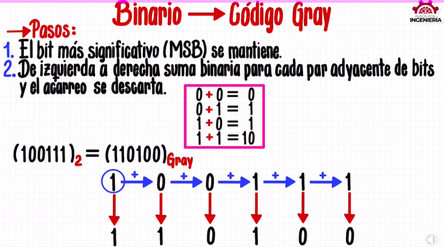
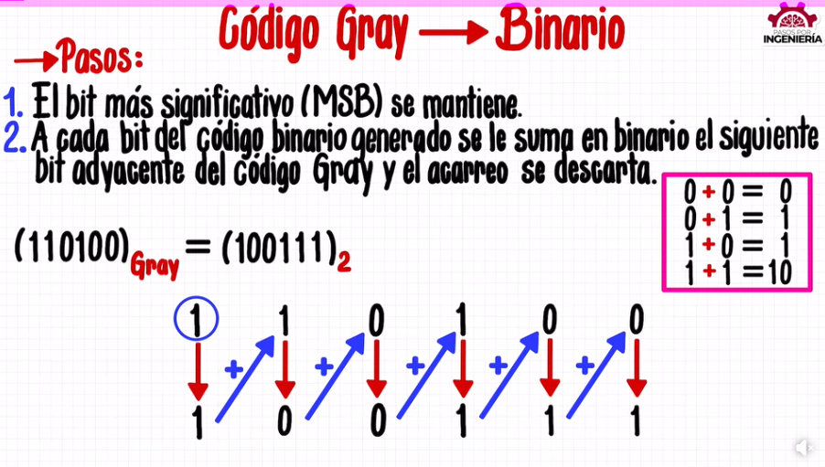

# Complemento


Técnica usada por el procesador para efectuar restas
### Fórmula:
> r^n - N
### Características:


- N: Número
- n: Dígitos
- r: Base


**Diff:** El valor varía según la cantidad de dígitos. 598 no otorga el mismo valor que 0598.


### Ejemplos:


Complemento a 10 de 598? __9402__


10^3 - 598 = 402


Complemento a 10 de 0598? __9402__


10^4 - 0598 = 9402


## Complemento a 1
### Características:


Procedimiento: Se invierte el número


### Ejemplos:
Complemento 1 de 110₂ : __001₂__


Complemento 1 de 1110₂ : __0001₂__


## Complemento a 2
### Características:


Procedimiento: Complemento a 1 y se suma 1₂


### Ejemplos:
Complemento a 2 de 110₂ : 001₂ + 1₂ = __010₂__


Complemento a 2 de 11110₂ : __00010₂__


Se suma 1+1 = 0 y 1 de acarreo


## Resta en sistema computacional
### Fórmula:
> M - N + r^n


### Características:
- M=N | => 0
- M>N | M-N>0
- M<N | M-N<0
>


### Pasos:
1. Igualar bases de ambos números
2. Complemento de 2 de valor a restar
3. Se realiza la suma
4. Se elimina el acarreo


### Ejemplos


#### Caso positivo:
11010₂ - 010₂ = ____


1. Igualar cantidad de dígitos sin que afecte el resultado del valor.
2. Complemento de 2 de 00010 = 11110.
3. Se completa sumando ambos valores:
```
 11010
+11110
------
111000
```
4. Se elimina el acarreo final completando el resultado 11000₂


---
11111₂ - 1010₂ = ____


- 11111₂ - 01010₂
- 11111₂ + 10110₂
```
 11111
+10110
------
110101
```
- R/ 10101₂


#### Caso negativo:


**Nota:** Procesador guarda bit con el complemento del resultado en caso de que sea negativo


110₂ - 10110₂ = ____


1. Unificar bases: 00110₂ - 10110₂
2. Complemento 2 de 10110₂ : 01010₂ | El que se resta se hace comp.
3. No debe de haber acarreo en suma
```
 00110
+01010
------
 10000     // Sin acarreo
```
4. Complemento 2 de resultado de la suma 10000₂ : 01111₂+1₂ = -10000₂


---
1010₂ - 111100₂ = ____


- 001010₂ - 111100₂
- 001010₂ + 000100₂
```
 001010
+000100
-------
 001110
```
- Comp: -110010₂
- R/ -110010₂


### Bit de signo:


- n<0 | b=1
- n>0 | b=0


# Códigos binarios


Es un conjunto de n bits


### Decimal Codificado Binario (BCD)


Tiene máximo 10 dígitos decimales


| Sim. Dec | Dígito BCD |
|:--------:|:----------:|
0 |0000
1 |0001
2 |0010
3 |0011
4 |0100
5 |0101
6 |0110
7 |0111
8 |1000
9 |1001


### Suma BCD


#### Pasos:
1. Se transforma en dígito BCD
2. Se suma bit por bit
3. Luego, si no forma parte de la lista de BCD, el resultante se le suma 6 y se obtiene un nuevo valor.
4. Si existe acarreo, se envia hacia el siguiente valor de la izquierda.
5. Repetir paso 3 hasta llegar al final.


#### Ejemplo 1:
```
 189
+286
-------
 475


 o bien


 0100 0111 0101


Equivalencias:


 0001  1000  1001
+0010  1000  0110
------------------
 0011 10000 1111
+           0110
          --------
          [1]0101   Y se genera acarreo
      10001
  +    0110
    -------
    [1]0111    Y se genera acarreo
0011
+  1
----
0100


 4    7   5


Nota: Si se pasa de 9, se corrige sumando 6
```


#### Ejemplo 2:
```
 988
+889
-----
 1877


 o bien


 0001 1000 0111 0111


 1001   1000   1000
+1000   1000   1001
------------------------
10001 10000 10001
+            0110
           --------
           [1]0111   Y se genera acarreo
      10001
  +    0110
    -------
    [1]0111    Y se genera acarreo
10010
+0110
-----
[1]1000   Y se genera acarreo


1


1   8    7    7


```


#### Ejemplo 3:
```
 890
+111
-----
1001


 o bien


0001 0000 0000 0001


 1000   1001   0000
+0001   0001   0001
------------------------
 1001   1010   0001
   +    0110
     -------
     [1]0000    Y se genera acarreo
 1010
+0110
-----
[1]0000   Y se genera acarreo


1


1    0     0     1


```


## Código de Gray


| C. Gray  | Equiv Dec. |
|:--------:|:----------:|
0000 |0
0001 |1
0011 |2
0010 |3
0110 |4
0111 |5
0101 |6
0100 |7
1100 |8
1101 |9
1111 |10
1110 |11
1010 |12
1011 |13
1001 |14
1000 |15

### Binario -> Gray

### Pasos
1. Se mantiene el primer dígito
2. Se suma en pares de dígitos
3. Repetir hasta acabar sin dígitos

### Ejemplo
```
Número 1100₂

Proceso:

1. Se mantiene primer dígito: 1
2. Se realiza la suma de pares

1 + 1 + 0 + 0
|  \   \   \
1   0   1   0

Primer par: 11 = 0
Segundo par: 10 = 1
Tercer par: 00 = 0

3. Finalizar y juntar todos los dígitos obtenidos: 1010

Resultado final:
1100₂
|
v
1010 (G)
```

#### Ejemplo Gráfico



### Gray -> Binario 

### Pasos
1. Se mantiene el primer dígito
2. Se suma el último dígito agregado con el siguiente del original
3. Repetir hasta acabar sin dígitos

### Ejemplo
```
Número 1111₂

Proceso:

1. Se mantiene primer dígito: 1
2. Se realiza la suma de los pares

Primer par: 11 = 0
Segundo par: 01 = 1
Tercer par: 11 = 0

1  1  1  1
|+/|+/|+/|
1  0  1  0

3. Finalizar y juntar todos los dígitos obtenidos: 1010

Resultado final:
1111 (G)
|
v
1010₂
```

#### Ejemplo Gráfico



