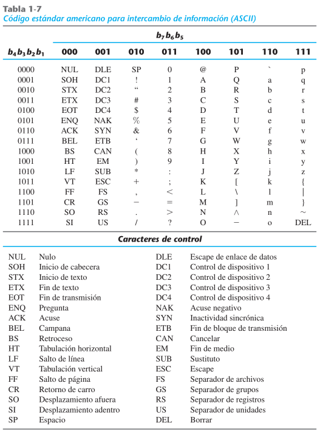
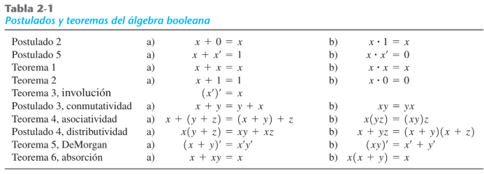

# Código ASCII

> Nota: Velocidad de internet medido en bits por segundo, 2^x.

## Contexto: ¿Por qué medir en bits por segundo?
La velocidad de transmisión de datos en redes se mide típicamente en **bits por segundo (bps)**, y sus múltiplos suelen expresarse como potencias de 2 (2^x), ya que los sistemas digitales trabajan de forma binaria.

* Ejemplos de unidades comunes: Kbps (kilobits por segundo), Mbps (megabits por segundo), Gbps (gigabits por segundo).
* Es importante no confundir bits por segundo (bps) con bytes por segundo (Bps); 1 byte = 8 bits, por lo que una conexión de 100 Mbps equivale aproximadamente a 12.5 MB/s de descarga real.

> Explicación práctica de ley de Ohm: Si tiene una resistencia, cuando pasa corriente genera voltaje. Los 8bit para cada tecla es diferente. Computacionales son sistema digital, basado en 4bit, 8bit, 16bit. Osea una combinación de 2^x. Estándar existe para que todo hable el mismo idioma.

### Relación con la Ley de Ohm
La Ley de Ohm establece que el voltaje (V) es igual a la corriente (I) multiplicada por la resistencia (R): **V = I × R**. Esto es relevante en sistemas digitales porque:

* Cuando una corriente circula a través de una resistencia, se genera una caída de voltaje.
* Esta relación explica físicamente cómo los circuitos digitales logran generar los niveles de voltaje (0V o 5V) que representan los bits 0 y 1.
* Cada combinación de bits (4, 8 o 16 bits) permite representar 2^x valores distintos, por lo que entre más bits se utilicen, mayor será la cantidad de caracteres o valores diferentes que se pueden codificar.

### ¿Qué es el código ASCII?
**ASCII** (American Standard Code for Information Interchange) es un estándar de codificación de caracteres que asigna un valor numérico (representado en binario) a cada letra, número, signo de puntuación y carácter de control utilizado en los sistemas computacionales. La existencia de un estándar como ASCII permite que todos los dispositivos "hablen el mismo idioma", es decir, que interpreten de la misma forma una secuencia de bits como el mismo carácter, sin importar el fabricante o el sistema operativo.

* ASCII estándar utiliza **7 bits**, lo que permite representar 2⁷ = 128 caracteres diferentes (valores del 0 al 127).
* Existe también el ASCII extendido, que utiliza 8 bits (incluyendo el bit de paridad o un bit adicional), permitiendo hasta 256 combinaciones.
* Incluye letras mayúsculas y minúsculas, dígitos del 0 al 9, signos de puntuación, y caracteres de control (como salto de línea, tabulación, etc.).

## Tabla de ejemplo

> Se toma los valores de arriba para b7b6b5, y los valores de la izquierda para el resto de bits.



> Bit de paridad (Detección de errores) (Bit de signo) (MSB)

| b7 | b6 | b5 | b4 | b3 | b2 | b1 | Resultado |
|:--:|:--:|:--:|:--:|:--:|:--:|:--:|:---------:|
| 1  | 0  | 0  | 0  | 0  | 0  | 1  | A         |
| 1  | 0  | 0  | 0  | 0  | 0  | 0  | @         |

### Explicación de la lectura de la tabla ASCII
Para obtener el carácter correspondiente a una combinación de bits, se combinan los tres bits más significativos (b7 b6 b5), que definen la "columna" o el grupo de caracteres, con los bits restantes (b4 b3 b2 b1), que definen la fila específica dentro de ese grupo. La tabla ASCII estándar se organiza generalmente así:

| b7 b6 b5 | Rango de caracteres              |
|:--------:|:-----------------------------------|
| 000      | Caracteres de control              |
| 001      | Signos de puntuación y símbolos    |
| 010      | Dígitos y algunos símbolos         |
| 011      | Dígitos 0-9 y símbolos adicionales |
| 100      | Letras mayúsculas (A-O)            |
| 101      | Letras mayúsculas (P-Z) y símbolos |
| 110      | Letras minúsculas (a-o)            |
| 111      | Letras minúsculas (p-z) y símbolos |

#### Ejemplo adicional: Código ASCII de la letra 'B'
La letra 'B' corresponde al valor decimal 66, cuyo binario de 8 bits es **01000010**.

| b7 | b6 | b5 | b4 | b3 | b2 | b1 | Resultado |
|:--:|:--:|:--:|:--:|:--:|:--:|:--:|:---------:|
| 1  | 0  | 0  | 0  | 0  | 0  | 1  | A         |
| 1  | 0  | 0  | 0  | 0  | 1  | 0  | B         |

> Nótese que al aumentar en 1 el valor de los bits menos significativos, se avanza al siguiente carácter en la tabla (de A a B), ya que la codificación ASCII sigue un orden consecutivo para las letras del alfabeto.

### Ejemplo Bin a Dec

```
1010 1000
10x16 8  => 168
```

> Se toma los segmentos de 4 bits y se obtiene su valor decimal y se multiplica por 16^x, luego se suma. Donde x es su posición del bloque.

#### Explicación paso a paso del ejemplo
El número binario `1010 1000` se divide en dos bloques de 4 bits:

* Primer bloque (izquierda): `1010` = 10 en decimal
* Segundo bloque (derecha): `1000` = 8 en decimal

Luego, cada bloque se multiplica por 16 elevado a la posición que ocupa (comenzando en 0 desde la derecha):

* 10 × 16¹ = 160
* 8 × 16⁰ = 8

Sumando ambos resultados: 160 + 8 = **168**

> Este método es una forma abreviada de convertir un número binario a decimal utilizando su representación hexadecimal intermedia, aprovechando que cada bloque de 4 bits corresponde exactamente a un dígito hexadecimal.

#### Ejemplo adicional: Bin a Dec con 0110 1101

* Primer bloque: `0110` = 6 en decimal → 6 × 16¹ = 96
* Segundo bloque: `1101` = 13 en decimal → 13 × 16⁰ = 13

Suma total: 96 + 13 = **109**

**0110 1101₂ = 109 en decimal**

## Protocolo de envío: Paridad

El **bit de paridad** es un mecanismo simple de detección de errores utilizado en la transmisión de datos, que consiste en agregar un bit adicional a la secuencia de datos enviada, de forma que la cantidad total de unos (1) en la secuencia cumpla con una condición específica (par o impar).

- **Par:** Contar cantidades de 1 debe ser par, resultado 0, sino 1.
- **Impar:** Contar cantidades de 1 debe ser impar, resultado 0, sino 1.

Los 8bits deben de tener la paridad indicada, en base a lo que se indique si este es par o impar.

### ¿Cómo funciona la detección de errores con paridad?
* El emisor calcula el bit de paridad antes de enviar los datos, agregándolo a la secuencia.
* El receptor, al recibir la secuencia completa (datos + bit de paridad), vuelve a contar la cantidad de unos y verifica si cumple con la condición de paridad acordada (par o impar).
* Si la paridad no coincide con lo esperado, se detecta que ocurrió un **error de transmisión** (aunque este método no permite identificar cuál bit específico cambió, ni corregirlo).
* Es un método sencillo, pero limitado: solo detecta errores cuando la cantidad de bits alterados es impar; si se alteran 2 bits simultáneamente, el error no sería detectado.

## Ejemplo Tarea

Par   | [1] 1 1 0 0 0 0 1 | a  | Paridad es 1 debido a que ya que hay una cantidad impar de 1, error de paridad
|:--:|:--:|:--:|:--:|
Impar | [0] 1 1 0 0 0 1 0 | b  | Paridad es 0 debido a que ya hay una cantidad impar de 1

### Ejemplo adicional de paridad par
Secuencia de datos: `1 0 1 0 0 1 1` (letra hipotética 'x')

* Cantidad de unos en los datos: 4 (cantidad par)
* Como la paridad debe ser **par**, y ya hay una cantidad par de unos, el bit de paridad agregado es **0**.
* Secuencia final transmitida: `[0] 1 0 1 0 0 1 1`

### Ejemplo adicional de paridad impar
Secuencia de datos: `1 1 1 0 0 0 0` (letra hipotética 'y')

* Cantidad de unos en los datos: 3 (cantidad impar)
* Como la paridad debe ser **impar**, y ya hay una cantidad impar de unos, el bit de paridad agregado es **0**.
* Secuencia final transmitida: `[0] 1 1 1 0 0 0 0`

### Resumen de la lógica de paridad

| Tipo de paridad | Condición para bit = 0        | Condición para bit = 1        |
|:----------------:|:---------------------------------|:---------------------------------|
| Par              | Cantidad de 1's ya es par        | Cantidad de 1's es impar (se ajusta) |
| Impar            | Cantidad de 1's ya es impar      | Cantidad de 1's es par (se ajusta)   |

---

# Álgebra booleana

## Conceptos previos: Simular vs Emular

- Simular: Imitación, puro software.
- Emular: Si utiliza recursos CPU es emular.

### Ampliación del concepto
* **Simular** implica recrear el comportamiento de un sistema mediante software, sin necesariamente replicar su funcionamiento interno real; es una imitación a nivel de resultados.
* **Emular** implica reproducir el comportamiento de un sistema (por ejemplo, hardware específico) utilizando recursos reales del procesador (CPU) para replicar su funcionamiento interno de manera más fiel, no solo el resultado final.
* Un ejemplo práctico: un emulador de consola de videojuegos reproduce el comportamiento del hardware original utilizando la CPU del dispositivo anfitrión, mientras que un simulador de vuelo imita el comportamiento de un avión sin replicar hardware real.

## Ventaja de reducir cantidad de componentes electrónicos

El álgebra booleana permite simplificar expresiones lógicas complejas, lo cual se traduce directamente en una **reducción de la cantidad de componentes electrónicos** (compuertas lógicas) necesarios para implementar un circuito digital. Esto tiene beneficios importantes:

* Reduce el costo de fabricación del circuito.
* Disminuye el consumo de energía.
* Reduce el tamaño físico del circuito.
* Disminuye la probabilidad de fallas, al haber menos componentes involucrados.
* Mejora la velocidad de respuesta del circuito, al reducir el número de etapas que la señal debe atravesar.

---



## Operadores booleanos básicos

### Explicación de los operadores

| Operador | Notación | Significado                                            | Resultado es 1 cuando...          |
|:--------:|:--------:|:---------------------------------------------------------|:--------------------------------------|
| AND      | xy o x·y | Producto lógico                                          | Ambas entradas son 1                  |
| OR       | x+y      | Suma lógica                                               | Al menos una entrada es 1             |
| NOT      | x'       | Negación o inversión                                      | La entrada original es 0              |

### Tabla de verdad AND

| x | y | x·y |
|:-:|:-:|:---:|
| 0 | 0 | 0   |
| 0 | 1 | 0   |
| 1 | 0 | 0   |
| 1 | 1 | 1   |

### Tabla de verdad OR

| x | y | x+y |
|:-:|:-:|:---:|
| 0 | 0 | 0   |
| 0 | 1 | 1   |
| 1 | 0 | 1   |
| 1 | 1 | 1   |

### Explicación de VCC y Ground (Tierra)
* **VCC**: es la fuente de voltaje que alimenta el circuito, típicamente 5V en los circuitos digitales TTL clásicos (o 3.3V en tecnologías más modernas).
* **Ground (Tierra/GND)**: es el punto de referencia de 0V del circuito; se ocupa tierra para **cerrar el circuito**, es decir, para que la corriente pueda completar su recorrido y regresar a la fuente.

## Diferencia entre x + 0 = x, letargo o delay

Prima de 5V es tierra, x con un inversor es x'.

### Ampliación
* La expresión **x + 0 = x** es una de las propiedades del álgebra booleana (identidad para la operación OR): sumar 0 (lógicamente) a cualquier valor no altera su resultado.
* El **letargo o delay** hace referencia al pequeño tiempo de propagación que toma una señal en atravesar una compuerta lógica o un componente electrónico; ningún componente responde de manera instantánea, siempre existe un retardo físico, por mínimo que sea.
* La negación de x, representada como **x'** (x prima), se obtiene mediante un **inversor** (compuerta NOT), y su valor de salida es siempre el complemento lógico de la entrada.

## Configuración física de los chips lógicos

14 Pines, VCC siempre conectado a 5V. Chip debe tener voltaje de referencia 0, lo que genera corriente es la diferencia de voltaje.

### Ampliación
* Los circuitos integrados de compuertas lógicas clásicos (como la familia 74xx) suelen venir en encapsulados de **14 pines**, donde generalmente el pin de VCC y el de GND (tierra) se ubican en esquinas opuestas del chip.
* El chip necesita un voltaje de referencia de **0V (tierra)** para poder establecer una diferencia de potencial con respecto a VCC; es precisamente esta diferencia de voltaje la que genera el flujo de corriente que permite el funcionamiento del circuito, en concordancia con la Ley de Ohm mencionada anteriormente.

### ¿Cómo es posible que una NAND que recibe entradas 0|0 genere 1, o sea energía?

Lo que sucede es que el transitor se enciende cuando VCC provee 5V, lo que provoca que se reste un voltaje similar provocando que de entrada 1 genere 0, pero cuando VCC provee 0V el transistor no se enciende, lo que provoca ahora que el voltaje que se debió restar se mantenga igual y este si se envié.

Se ocupa tierra para cerrar el circuito.

Sistemas digitales están diseñados para bajo voltaje y baja corriente.

### Explicación complementaria sobre la compuerta NAND
La compuerta **NAND** (NOT-AND) es una compuerta universal, lo que significa que cualquier otra compuerta lógica (AND, OR, NOT, etc.) puede construirse utilizando únicamente compuertas NAND. Su tabla de verdad es la negación de la tabla AND:

| x | y | (xy)' (NAND) |
|:-:|:-:|:------------:|
| 0 | 0 | 1            |
| 0 | 1 | 1            |
| 1 | 0 | 1            |
| 1 | 1 | 0            |

* A nivel de transistores, la compuerta NAND se construye de tal forma que **solo** genera una salida en 0 (bajo voltaje) cuando ambas entradas están en 1 (alto voltaje, es decir, ambos transistores conducen y "restan" el voltaje).
* Cuando alguna entrada está en 0V, el transistor correspondiente no conduce, por lo que el voltaje de salida se mantiene alto (cercano a VCC), interpretándose como un 1 lógico.
* Es por esta razón que una NAND con ambas entradas en 0 genera una salida en 1: al no conducir ningún transistor de la rama correspondiente, el voltaje de VCC se refleja directamente en la salida sin ser "restado".

### Compuertas lógicas universales

| Compuerta | Es universal | Motivo                                                    |
|:---------:|:-------------:|:--------------------------------------------------------------|
| NAND      | Sí            | Puede formar AND, OR, NOT y todas las demás combinándose entre sí |
| NOR       | Sí            | Igual que NAND, puede replicar todas las demás compuertas       |
| AND       | No            | No puede generar NOT por sí sola                                |
| OR        | No            | No puede generar NOT por sí sola                                |

---

# Digitalwork

## Half Adder

### Definición
El **Half Adder** (medio sumador) es un circuito combinacional digital que realiza la suma de **dos bits individuales**, produciendo como resultado un bit de suma (S) y un bit de acarreo (Carry, C). Es el bloque fundamental a partir del cual se construyen sumadores más complejos, como el Full Adder (sumador completo), capaz de sumar tres bits (incluyendo un acarreo de entrada).

### Tabla de verdad del Half Adder

| x | y | Suma (S) | Acarreo (C) |
|:-:|:-:|:--------:|:-----------:|
| 0 | 0 | 0        | 0           |
| 0 | 1 | 1        | 0           |
| 1 | 0 | 1        | 0           |
| 1 | 1 | 0        | 1           |

### Expresiones booleanas del Half Adder
* **Suma (S)**: corresponde a la operación XOR entre las dos entradas → S = x ⊕ y
* **Acarreo (C)**: corresponde a la operación AND entre las dos entradas → C = x · y

### Diferencia entre Half Adder y Full Adder

| Característica              | Half Adder                          | Full Adder                                  |
|:-------------------------------|:---------------------------------------|:------------------------------------------------|
| Entradas                     | 2 bits (x, y)                        | 3 bits (x, y, acarreo de entrada Cin)          |
| Salidas                      | Suma y acarreo                        | Suma y acarreo                                  |
| Uso                          | Suma de bits individuales sin acarreo previo | Suma de bits considerando acarreo de una etapa anterior |
| Aplicación típica             | Primer bit (menos significativo) de un sumador de varios bits | Resto de los bits en un sumador de varios bits  |

> Nota: Para sumar números binarios de más de 1 bit, se utiliza un Half Adder únicamente en la posición menos significativa (ya que no hay acarreo previo que considerar), y Full Adders encadenados para el resto de las posiciones, donde cada uno recibe el acarreo generado por la etapa anterior.

# Diagramas de esquema para cada compuerta lógica

## Compuerta AND

* Circuito integrado utilizado: **74LS08** (contiene 4 compuertas AND de 2 entradas).
* Configuración: pull-up con resistencias en las entradas 1(A) y 2(B), LEDs indicando el estado de cada entrada y de la salida 3(S).


*Esquema compuerta AND 7408*

## Compuerta OR

* Circuito integrado utilizado: **4071** (contiene 4 compuertas OR de 2 entradas).
* Configuración: pull-down con resistencias en las entradas 1(A) y 2(B), LEDs indicando el estado de cada entrada y de la salida 3(S).


*Esquema compuerta OR 4071*

## Compuerta NOT

* Circuito integrado utilizado: **74LS04** (contiene 6 inversores).
* Configuración: pull-down con resistencia en la entrada 1(A), LED indicando el estado de la entrada y de la salida 2(S).


*Esquema compuerta NOT 7404*

## Compuerta XOR

* Circuito integrado utilizado: **7486** (contiene 4 compuertas XOR de 2 entradas).
* Configuración: pull-down con resistencias en las entradas 1(A) y 2(B), LEDs indicando el estado de cada entrada y de la salida 3(S).


*Esquema compuerta XOR 7486*

## Compuerta XNOR

* Circuito integrado utilizado: **4077** (contiene 4 compuertas XNOR de 2 entradas).
* A diferencia del resto de compuertas, para este circuito la fuente no publicó un esquema con interruptores/LEDs en el mismo formato; en su lugar, se muestra el símbolo lógico (una XOR con un círculo de negación en la salida) y una animación del circuito de ejemplo con dos sensores digitales.


*Símbolo compuerta XNOR (XOR con negación en la salida)*


*Circuito de ejemplo compuerta XNOR 4077*

## Compuerta NAND

* Circuito integrado utilizado: **74LS00** (contiene 4 compuertas NAND de 2 entradas).
* Configuración: pull-up con resistencias en las entradas 1(A) y 2(B), LEDs indicando el estado de cada entrada y de la salida 3(S).


*Esquema compuerta NAND 7400*

## Compuerta NOR

* Circuito integrado utilizado: **74LS02** (contiene 4 compuertas NOR de 2 entradas).
* Configuración: pull-up con resistencias en las entradas 1(A) y 2(B), LEDs indicando el estado de cada entrada y de la salida 3(S).


*Esquema compuerta NOR 7402*

---

## Resumen de circuitos integrados por compuerta

| Compuerta | Circuito integrado | Entradas por compuerta | Compuertas por chip |
|:---------:|:-------------------:|:-----------------------:|:---------------------:|
| AND       | 74LS08              | 2                        | 4                     |
| OR        | 4071                | 2                        | 4                     |
| NOT       | 74LS04              | 1                        | 6                     |
| XOR       | 7486                | 2                        | 4                     |
| XNOR      | 4077                | 2                        | 4                     |
| NAND      | 74LS00              | 2                        | 4                     |
| NOR       | 74LS02              | 2                        | 4                     |

> Nota: al igual que en el esquema de ejemplo compartido (con `S1`, `SWS002`, `IC1A`, `74AC08N`), cada uno de estos esquemas utiliza un interruptor DIP para simular manualmente el estado lógico de las entradas (0V o 5V), resistencias para fijar el estado por defecto de la entrada (pull-up o pull-down) y LEDs para visualizar de forma física el estado lógico tanto de las entradas como de la salida de la compuerta.

## Implementación de compuertas lógicas utilizando NAND


